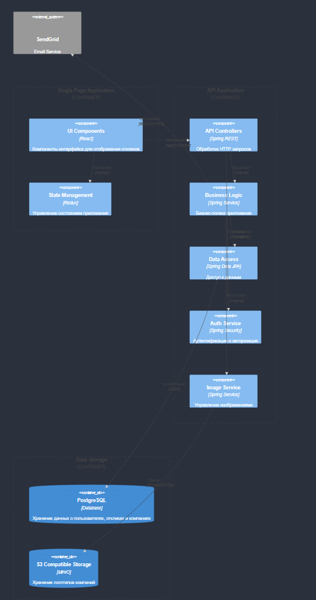

# Обоснование выбора архитектуры

## Выбор монолитной архитектуры

Выбрал монолитную архитектуру с элементами модульности, так как она лучше всего подходит для данного приложения по следующим причинам:

- Относительно небольшой масштаб системы
- Тесная связь между компонентами (отклики связаны с пользователями и компаниями)
- Простота развертывания и поддержки
- Отсутствие необходимости в независимом масштабировании компонентов
- Меньшие накладные расходы на коммуникацию между компонентами

## Основные принципы реализации

Для реализации данной архитектуры были приняты следующие решения:

- Модульная структура монолита с четким разделением ответственности между компонентами
- Централизованное хранилище данных для обеспечения целостности информации
- Отдельный сервис для работы с изображениями
- Асинхронная обработка уведомлений через интеграцию с внешним сервисом

## Используемые технологии

### Основные компоненты
- Frontend: React/Next.js с Redux
- Backend: Spring Boot
- Database: PostgreSQL
- Object Storage: MinIO (S3-compatible)
- Внешний сервис: SendGrid API

### Протоколы связи
- Frontend ↔ Backend: REST over HTTPS
- Backend ↔ Database: JDBC
- Backend ↔ MinIO: S3 API over HTTPS
- Backend ↔ SendGrid: REST over HTTPS

